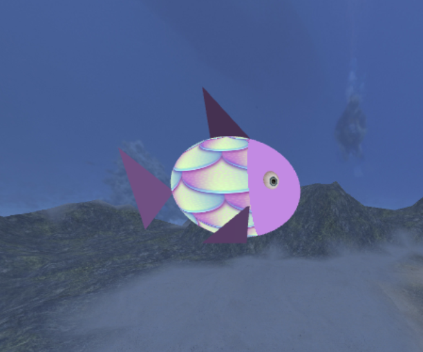
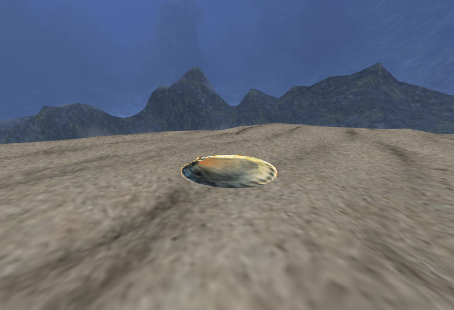
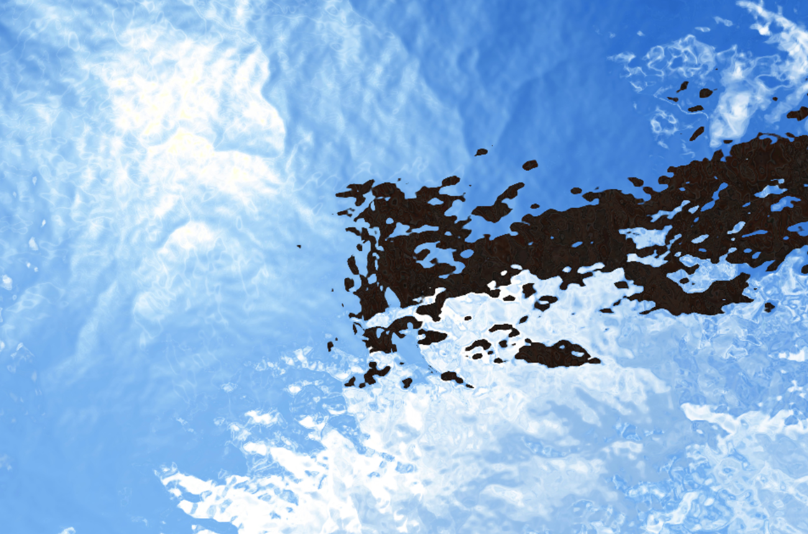
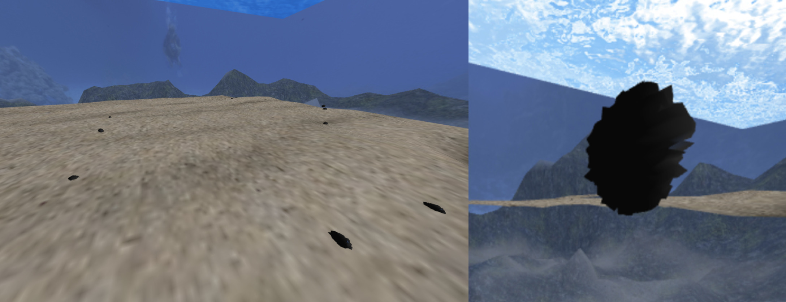
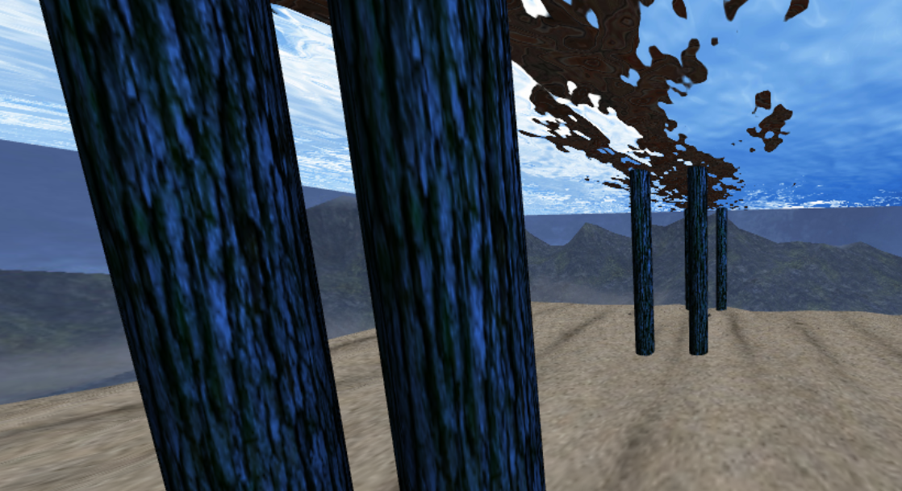
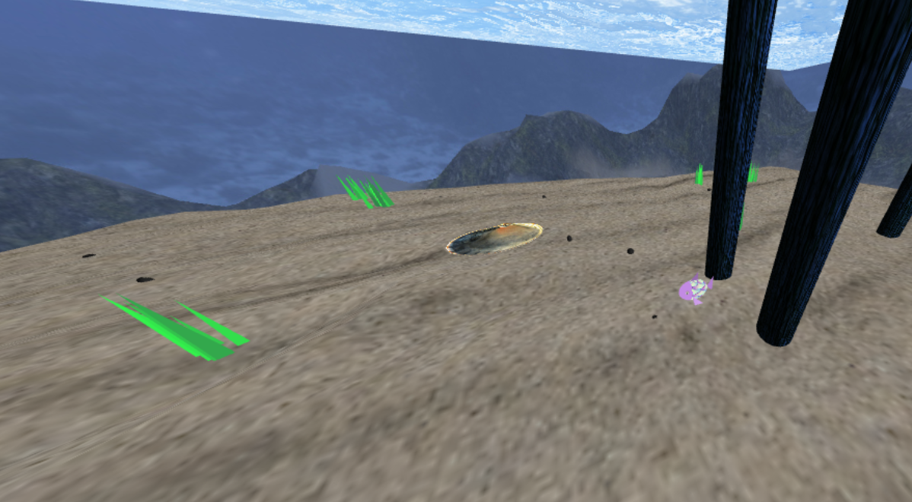
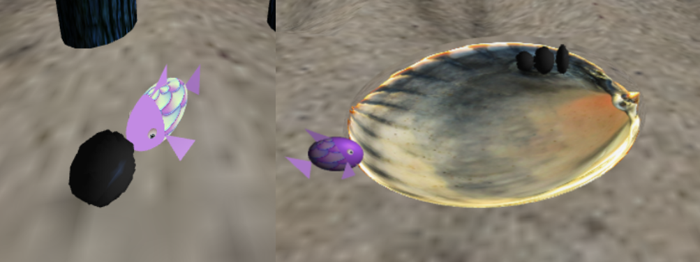
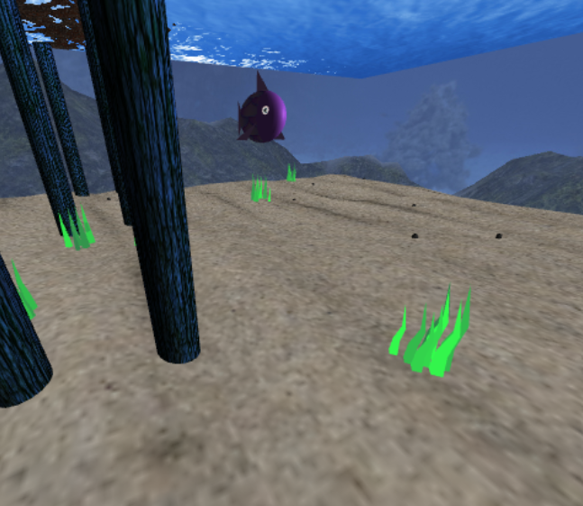

# CGRA 2020/2021

## Group T05G02

- André de Jesus Fernandes Flores - up201907001
- Diogo Luís Araújo de Faria - up201907014

## Project Notes

Como se pode ver na imagem seguinte, a modelação e animação do peixe está completa de acordo com o apresentado no enunciado:

|  | 
|:--:| 
| *proj-t05g02-1* |

&nbsp;

Verifica-se na próxima imagem a implementação do fundo de areia, utilizando o mapa de alturas, e com um ninho implementado com um objeto 3D:

|  | 
|:--:| 
| *proj-t05g02-2* |

&nbsp;

Na imagem seguinte verificam-se os detalhes da superifice da água:

|  | 
|:--:| 
| *proj-t05g02-3* |

&nbsp;

Como se pode ver, na esquerda estão várias pedras apresentadas no fundo de areia e à sua direita a pedra original:

|  | 
|:--:| 
| *proj-t05g02-4* |

&nbsp;

Na imagem seguinte, verificam-se os vários pilares implementados com uma textura de tronco de árvore:

|  | 
|:--:| 
| *proj-t05g02-5* |

&nbsp;

A imagem seguinte ilustra o fundo de areia já com as várias pedras espalhadas, o ninho, várias algas, os pilares e o peixe:

|  | 
|:--:| 
| *proj-t05g02-6* |

&nbsp;

Na próxima imagem verifica-se a implementação do peixe a carregar uma pedra e de como as pedras estão a ser postas no ninho:

|  | 
|:--:| 
| *proj-t05g02-7* |

&nbsp;

No ponto 7, foram realizados os seguintes pontos no total de 3 valores:
- 7.1. Algas
- 7.2. Algas animadas
- 7.6. Shader do peixe melhorado

|  | 
|:--:| 
| *proj-t05g02-8* |

